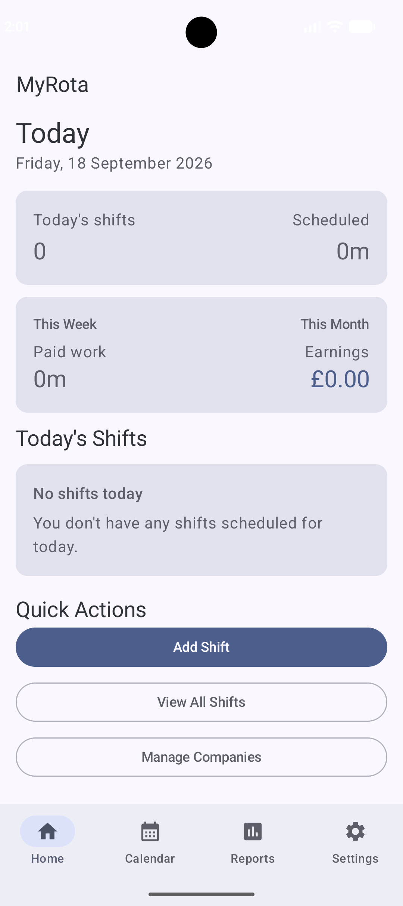
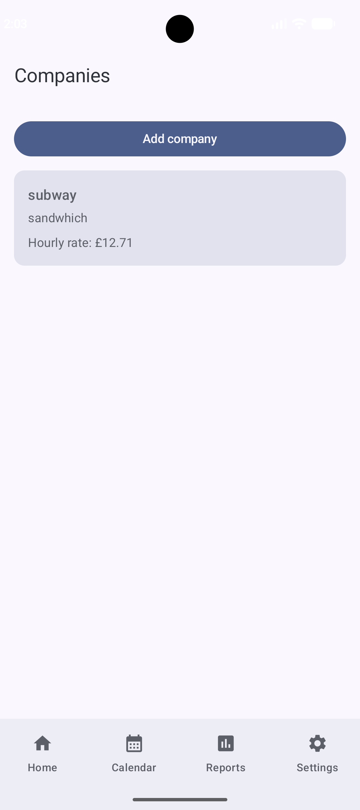
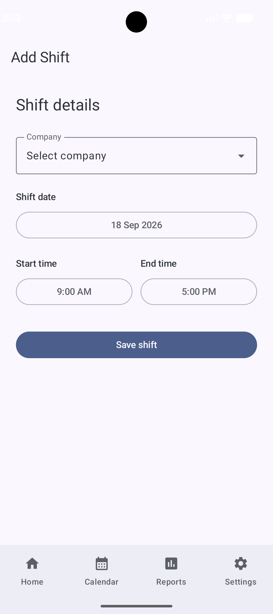
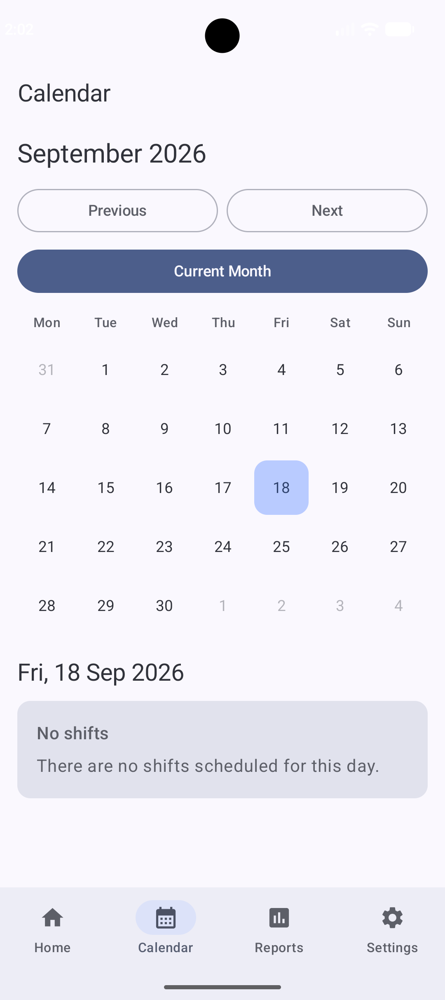
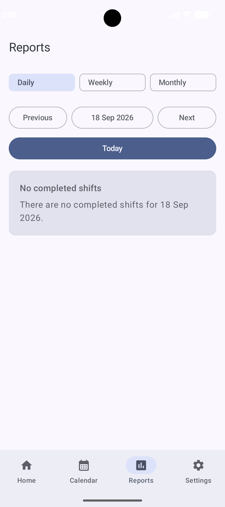
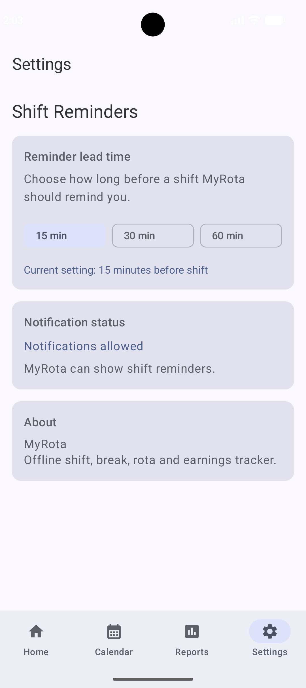

# MyRota

**MyRota** is a native Android shift and rota management application built with **Kotlin** and **Jetpack Compose**. It is designed for people who work across one or more companies and want a simple way to manage scheduled shifts, track actual working time, record paid/unpaid breaks, monitor earnings, review their rota in a calendar, and receive shift reminders.

The app is built as an **offline-first Android application** using **Room** for local persistence, so core functionality works without requiring an account or internet connection.

---

## ✨ Key Features

### 🏢 Multiple Companies
- Add and manage multiple employers/companies.
- Store company name, description, colour and optional hourly rate.
- Enable or disable notifications per company.
- Archive companies without deleting historical shift data.
- Historical shifts continue to retain the correct company details.

### 📅 Shift Scheduling
- Add, edit and cancel shifts.
- Support for multiple shifts on the same day.
- Support for overnight shifts.
- Detect overlapping shifts and warn before saving.
- Keep scheduled start/end time separate from actual clock-in/clock-out time.
- Preserve completed and cancelled shifts for history and reporting.

### ⏱ Shift Clocking
- Start a scheduled shift directly from the dashboard or shift list.
- End an in-progress shift.
- Record actual clock-in and clock-out timestamps.
- Completed shifts remain editable.

### ☕ Paid & Unpaid Breaks
- Add fixed **15, 30 or 60 minute** breaks.
- Mark breaks as paid or unpaid.
- Add multiple breaks to a shift.
- Edit or delete recorded breaks.
- Validation prevents invalid break totals for completed shifts.
- Historical invalid data is handled safely without corrupting earnings calculations.

### 💷 Earnings & Work Calculations
- Calculate scheduled duration.
- Calculate actual worked duration.
- Deduct unpaid breaks from paid working time.
- Track paid and unpaid break totals.
- Calculate estimated earnings using the company's hourly rate.
- Weekly paid-work summary.
- Monthly estimated earnings summary.

### 🏠 Dashboard
- Today's date and shift summary.
- Today's scheduled hours.
- Current or next shift.
- Start/end shift actions.
- Today's full shift list.
- Weekly paid work.
- Monthly earnings.
- Quick access to:
  - Add Shift
  - View All Shifts
  - Manage Companies

### 🗓 Monthly Calendar
- Monday-to-Sunday layout.
- Navigate between months.
- Quickly return to the current month.
- Company-coloured shift indicators.
- View shifts for a selected date.
- Tap a shift to edit it.
- Overnight shifts are clearly identified.

### 📊 Reports
MyRota includes three reporting modes:

#### Daily
- Shift-by-shift breakdown.
- Scheduled and actual time.
- Paid/unpaid breaks.
- Paid worked time.
- Estimated earnings.

#### Weekly
- Weekly summary.
- Breakdown by day from Monday to Sunday.
- Paid work and earnings totals.

#### Monthly
- Monthly summary.
- Breakdown by company.
- Breakdown by week.
- Estimated monthly earnings.

### 🔔 Shift Reminders
- Android notifications for upcoming shifts.
- Configurable reminder lead time:
  - 15 minutes
  - 30 minutes
  - 60 minutes
- Company-level notification control.
- Reminders are rescheduled when shifts or reminder settings change.
- Cancelled or started shifts no longer keep unnecessary reminder alarms.
- Tapping a reminder opens MyRota.

### 💾 Offline-First Storage
- Room database for companies, shifts and breaks.
- Data persists after closing or restarting the app.
- Database migrations preserve existing user data.
- No destructive database migration strategy is used.

---

## 📱 Screenshots

### Home


### Companies


### Shifts


### Calendar


### Reports


### Settings


---

## 🛠 Tech Stack

| Area | Technology |
|---|---|
| Language | Kotlin |
| UI | Jetpack Compose |
| Design System | Material 3 |
| Architecture | ViewModel + Repository pattern |
| Local Database | Room |
| Async / Reactive State | Kotlin Coroutines + Flow |
| Navigation | Navigation Compose |
| Settings Storage | DataStore Preferences |
| Notifications | Android Notification API + AlarmManager |
| Build System | Gradle Kotlin DSL |
| Symbol Processing | KSP |
| Minimum Android Version | Android 8.0 / API 26 |
| Target SDK | API 37 |

---

## 🧱 Project Structure

```text
com.myrota.app
├── calculation
│   └── ShiftCalculation.kt
│
├── data
│   ├── repository
│   │   ├── BreakRepository.kt
│   │   ├── CompanyRepository.kt
│   │   └── ShiftRepository.kt
│   │
│   └── settings
│       ├── AppSettings.kt
│       └── SettingsRepository.kt
│
├── local
│   ├── BreakDao.kt
│   ├── BreakEntity.kt
│   ├── CompanyDao.kt
│   ├── CompanyEntity.kt
│   ├── DatabaseMigrations.kt
│   ├── MyRotaDatabase.kt
│   ├── MyRotaDatabaseProvider.kt
│   ├── RoomConverters.kt
│   ├── ShiftDao.kt
│   ├── ShiftEntity.kt
│   └── ShiftStatus.kt
│
├── navigation
│
├── notifications
│   ├── NotificationHelper.kt
│   ├── ShiftReminderReceiver.kt
│   └── ShiftReminderScheduler.kt
│
├── ui
│   ├── breaks
│   ├── calendar
│   ├── companies
│   ├── dashboard
│   ├── reports
│   ├── settings
│   └── shifts
│
├── MainActivity.kt
└── MyRotaApplication.kt
```

---

## 🗄 Data Model

### Company
Each company can store:
- Company name
- Description
- Display colour
- Optional hourly rate
- Notification preference
- Active/archive status
- Created and updated timestamps

### Shift
Each shift stores:
- Company
- Scheduled start
- Scheduled end
- Actual start
- Actual end
- Notes
- Status
- Created and updated timestamps

Supported shift statuses:

```text
SCHEDULED
IN_PROGRESS
COMPLETED
CANCELLED
```

### Break
Each break stores:
- Shift ID
- Duration in minutes
- Paid/unpaid status
- Created and updated timestamps

---

## 🧮 Calculation Rules

MyRota deliberately separates **scheduled time** from **actual worked time**.

### Scheduled duration

```text
Scheduled End - Scheduled Start
```

### Actual duration

For completed shifts:

```text
Actual Clock Out - Actual Clock In
```

### Paid working time

```text
Actual Worked Minutes - Unpaid Break Minutes
```

Paid breaks remain part of paid working time.

### Estimated earnings

```text
Paid Worked Minutes × Hourly Rate / 60
```

Hourly rates are stored internally in **pence** to avoid common floating-point currency issues.

---

## 🌙 Overnight Shift Handling

If the selected end time is earlier than or equal to the start time, MyRota treats the end as occurring on the following day.

Example:

```text
Start: 10:00 PM
End:    6:00 AM
```

is treated as an 8-hour overnight shift.

---

## ⚠️ Overlap Detection

MyRota checks whether a new or edited shift overlaps another existing shift.

Conceptually:

```text
existingStart < newEnd
AND
existingEnd > newStart
```

Back-to-back shifts are therefore allowed.

If an overlap is detected, the user is warned and can still choose to continue.

---

## 🔐 Privacy

MyRota is currently designed as an **offline-first application**.

- No login is required.
- Core app data is stored locally on the device.
- No account is required to use the current Android version.

---

## 🚀 Getting Started

### Requirements
- Android Studio
- JDK compatible with the project configuration
- Android SDK with API 37 available
- Android device or emulator running API 26+

### Clone the repository

```bash
git clone https://github.com/YOUR_USERNAME/MyRota.git
cd MyRota
```

Open the project in Android Studio and allow Gradle to sync.

### Build

From Android Studio:

```text
Build → Make Project
```

or using Gradle:

```bash
./gradlew build
```

On Windows:

```powershell
gradlew.bat build
```

### Run

Connect an Android device with USB debugging enabled or start an Android emulator, then run the `app` configuration from Android Studio.

---

## 📦 APK Distribution

For personal/private distribution, a signed release APK can be generated from Android Studio:

```text
Build
→ Generate Signed App Bundle / APK
→ APK
→ Select release keystore
→ release
```

The generated signed APK can then be installed on compatible Android devices.

> **Important:** Release keystores and keystore passwords should never be committed to GitHub.

Recommended `.gitignore` entries:

```gitignore
*.jks
*.keystore
local.properties
.gradle/
.idea/
build/
app/build/
```

---

## 🧪 Validation Completed

The current MVP has been manually tested across the main user flows, including:

- Company creation, editing and archiving
- Historical company lookup
- Shift creation and editing
- Overlap warnings
- Overnight shifts
- Starting and ending shifts
- Paid/unpaid breaks
- Break validation
- Dashboard summaries
- Calendar navigation
- Daily/weekly/monthly reports
- Earnings calculations
- Notification reminders
- Configurable reminder timing
- Data persistence after app restart
- Signed Android release build

---

## 🗺 Roadmap

### Version 1 — Completed MVP
- Multiple companies
- Shift CRUD
- Shift start/end
- Fixed paid/unpaid breaks
- Dashboard
- Monthly calendar
- Daily/weekly/monthly reports
- Earnings calculations
- Shift reminders
- Offline Room persistence

### Version 2 — Planned
- Planned vs actual comparison
- Custom break durations
- Improved shift notes
- Overtime calculations
- PDF/CSV export
- Payslip-style reports
- Backup and restore
- Cloud sync

### Version 3 — Future
- CSV/Excel rota import
- OCR screenshot/photo rota extraction
- Calendar integration
- Recurring shifts
- Home-screen widget
- Wear OS support
- Payroll comparison

### iOS
An iOS version is planned separately. The current codebase is a native Android application.

---

## 🎯 Project Goal

MyRota was built to provide a practical shift-management solution while demonstrating end-to-end native Android development, including:

- Modern declarative UI development
- Local relational data modelling
- Database migrations
- Reactive state management
- Business-rule validation
- Time and earnings calculations
- Android notifications
- Release build preparation

---

## 👤 Author

**Iyer2505**

GitHub: [Iyer2505](https://github.com/Iyer2505)

---

## 📌 Status

**Android Version 1.0 — MVP Complete**

The Android MVP is functional and available for private installation using a signed APK.
